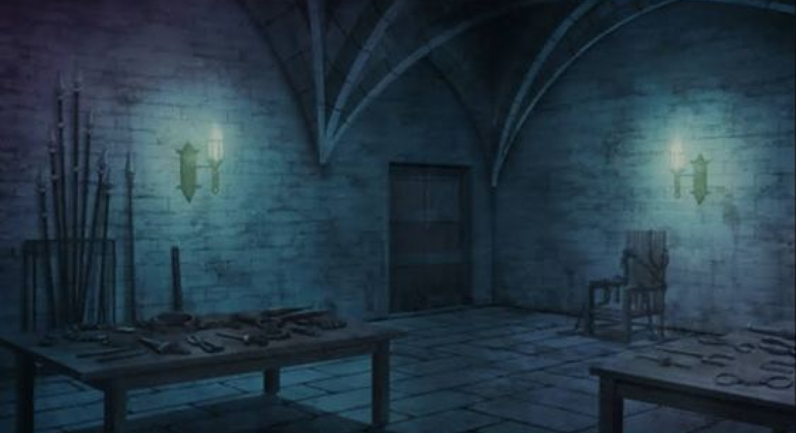

# Arbegna - 2D Side-Scrolling Shooter



**Arbegna** (meaning "Patriot" in Amharic) is a 2D side-scrolling shooter game developed as a university graphics class project using Pygame. Take control of a patriotic soldier defending against waves of enemies and powerful golems in this action-packed game.

## Game Features

- **Side-scrolling action gameplay** with smooth character movement
- **Multiple enemy types** with different behaviors and health points
- **Scoring system** with increasing difficulty
- **Health system** with visual health bars
- **Animated sprites** for all characters and enemies
- **Sound effects** and background music
- **Boss battles** with the powerful Golem enemy

## Controls

- **Left/Right Arrow Keys**: Move your character
- **Up Arrow Key**: Jump
- **Space Bar**: Shoot projectiles

## Installation

1. **Prerequisites**:
   - Python 3.x
   - Pygame library

2. **Install Dependencies**:
   ```bash
   pip install pygame
   ```

3. **Run the Game**:
   ```bash
   python main.py
   ```

## Game Mechanics

- **Player**: Control a soldier who can move left/right, jump, and shoot.
- **Enemies**: Regular enemies that move back and forth across the screen.
- **Golems**: Powerful boss enemies with more health that appear periodically.
- **Scoring**: Earn points by defeating enemies (1 point for regular enemies, 2 points for golems).
- **Health**: The player has 5 health points. Colliding with enemies reduces health.
- **Difficulty**: The game becomes progressively harder with increased enemy spawn rates.

## Assets

The game includes custom sprites and sound effects:
- **Characters**: Soldier, enemies, and golem sprites
- **Backgrounds**: Scrolling background with patriotic themes
- **Sounds**: Shooting, hit, and background music

## Project Structure

```
Arbegna/
├── main.py           # Main game logic and loop
├── enemy/           # Enemy sprites
├── golem/          # Golem boss sprites
├── soldier/        # Player character sprites
├── images/         # Background and UI images
├── sounds/         # Sound effects and music
└── README.md       # This file
```

## Academic Context

This game was developed as part of a university multimedia and graphics course to demonstrate:
- 2D game development concepts
- Sprite animation and collision detection
- Game state management
- Object-oriented programming in Python
- Sound and music integration
- UI design and implementation

## License

This project is licensed under the MIT License - see the [LICENSE](LICENSE) file for details.

## Acknowledgments

- Pygame library for game development
- All game assets created for educational purposes

